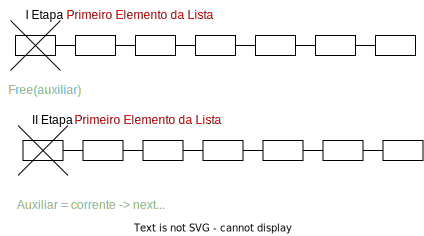

[🔝](../README.md)

# 11/03/2024 - Aula 004

## Remoção

> Este modulo/função. possui.
> três Etapas:
>   I Etapa: Elemento na Lista
>   II Etapa: O Elemento de encontra no meio da Lista;
>   III Etapa: O Elemento se Encontra no final da lista;

