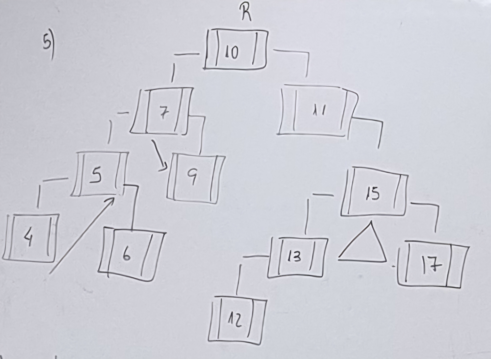
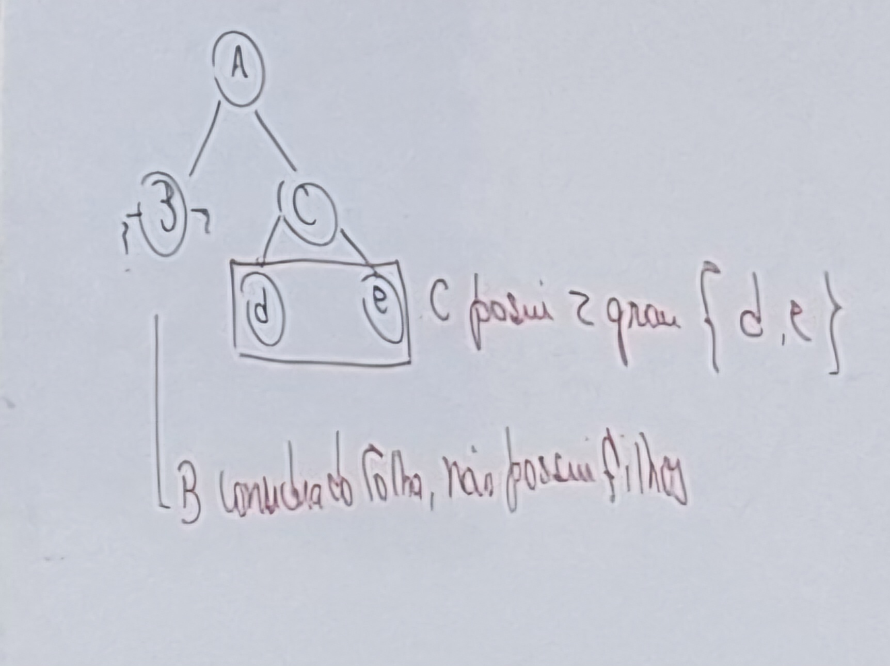

# Questões para a Prova

1. Arvore Binária, técnica para recuperação de dado. Para que pessoa ter sucesso é necessario o que: 
**R: Organizados.**

2. Converta de infixa para pos-fixa

    a. A+B-C 
    **R: ABC-+**

    b. (n*(t/j)-k) 
    **R: hts/k-**

3. Cada estrutura analizada esta vinculado ao processo gerencial computacional. Cite esta associação (Pilha, Filas, Árvores e Árvore Binária).

    **R:  Pilha - gerenciamento de memoria** 
    **Fila - gerenciamento de Processo** 
    **Árvore - gerenciamento de cores Pixel e Pastas/diretorios** 
    **Árvore Binaria - Organização de Dados/Arquivos ou tabelas** 

4. LIFO pertence qual estrutura e o termo é designado, corrresponde o que?

    **R:  LIFO => Last in / Firt out** 
    **Pilhas=> funções -  Push/Pop/Top**  

5. Desenvolva a seguinte AB, conforme os dado abaixo, considerando que a Raiz é {10} 
Ler 
-> 

6. Hashing e arvore Bínaria, qual a diferença 
    **R: A tecnica heshing, que significa espalhamento posui a mesma eficiencia que a tecnica arvore binária. A tecnica, cinsiste em estabelecer uma chave para cada registro seja, alfanumérico ou numerica.** 
**A deferença entre AB e hashing e o seguinte.** 
**a. AB ela necessita que os dados estejam organizados**
**b. hashing os dados não necessita que estejam organizados, para sua recureção.** 

7. Quantos filhos pode um nodo ter e qual o termo adotado em um AB.

    **R: quantos numeros de filhos que um nodo pode ter são dois. o termo adotado para saver a quantidade de dependentes conhecido como grau.conforme lay-out avaixo.** 

8. AVL Adilson Velkis e Landis, estabelece o Balanciamento de nodos em que estruturá: 
    **R: Arvore Binaria, esta tecnica tem como ffinalizadade em reduzir o tem na recuperação do Registrou em uma tabela. Esta tecnica apresentou uma otima solução, até  hoje utilizada.**

9. O que é uma estrutura heterogenia e qual a sua vantagem? 
    **R: estrutura heterigenea permite ter varios tipos de campos em um unico conjunto de dados, conhecido como registro.**

10. Organização indexada termo adotado em BD, pode referir em qual estrutura? 
    **R: Arvore Binaria, conhecida também como:  - Organização  - Tabela indexada   - Arvore indexada**
