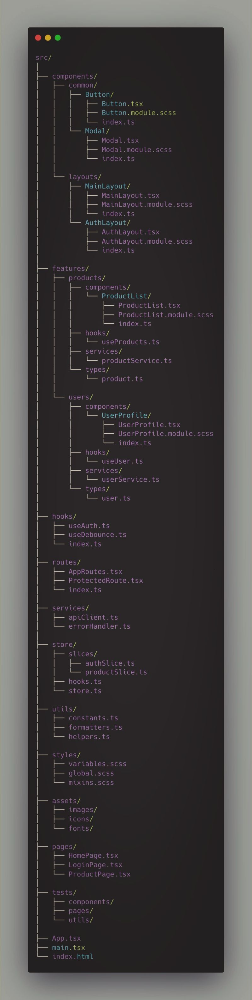

# 🧱 Arquitetura limpa para aplicativos 🔥 React escaláveis

"Estruture sua base de código React como um profissional."

Quando você está criando aplicativos React de nível de produção, coisas como escalabilidade, modularidade e capacidade de manutenção não são opcionais - elas são essenciais.

Aqui está uma estrutura de pastas comprovada e uma estratégia de arquitetura que sigo em projetos do mundo real:

🔍 Princípios fundamentais
✅ Estrutura de recursos em primeiro lugar (Feature-first structure)
→ Organize componentes, serviços, tipos e testes por recurso, não por tipo de arquivo.
 features/products/, features/users/

✅ Sistema de interface do usuário reutilizável (Reusable UI system)
→ Componentes e layouts compartilhados residem em:
 components/common/, components/layouts/

✅ Camada de API tipada e modular (Typed modular API layer)
→ Limpe os clientes da API com tratamento de erros:
 services/apiClient.ts, utils/errorHandler.ts

✅ Gerenciamento de estado com o Redux Toolkit (Redux Toolkit modular state management)
→ Fatias modulares e ganchos digitados:
 store/slices/, store/hooks.ts

✅ Ganchos personalizados reutilizáveis (Reusable custom hooks)
→ Lógica de negócios abstraída para:
 hooks/useXyz.ts

✅ Sistema de estilo consistente (Consistent styling system)
→ Módulos SCSS com temas globais:
 styles/variables.module.scss, styles/global.scss

✅ Código testável (Testable code structure)
→ Testes próximos a recursos/componentes:
 __tests__/ folders or *.test.tsx

✅ Organização de ativos e configuração (Assets and config organization)
→ Arquivos estáticos e configurações de ambiente:
 assets/, config/routes.ts

🛠 Tech Stack
▪️ React + TypeScript
▪️ Redux Toolkit
▪️ React Router v6
▪️ SCSS Modules
▪️ Axios

📂 Exemplo de estrutura de pastas
src/
├── assets/
├── components/
│  ├── common/
│  └── layouts/
├── config/
│  └── routes.ts
├── features/
│  ├── auth/
│  └── products/
├── hooks/
├── services/
│  └── apiClient.ts
├── store/
│  ├── slices/
│  └── hooks.ts
├── styles/
│  ├── global.scss
│  └── variables.module.scss
├── utils/
└── App.tsx

📈 Por que isso funciona
✔️ Separação clara de preocupações
✔️ Integração amigável para a equipe
✔️ Código modular e reutilizável
✔️ Melhores diferenças do Git e revisão de PR
✔️ Fácil de dimensionar, depurar e testar

💡 Esteja você começando do zero ou reestruturando um aplicativo em crescimento, uma arquitetura limpa economizará tempo, dívidas técnicas e dores de cabeça mais tarde.

Você gostaria de um modelo do GitHub baseado nessa estrutura? Deixe um 🔁 nos comentários!

**Fonte:** [Rafael Santos - LinkedIn](https://www.linkedin.com/posts/activity-7347961287940763648-C_Hg/?utm_source=share&utm_medium=member_android&rcm=ACoAAAYBPzIBKffzZrF4YJedjkIZDaIitl-iiIA)
